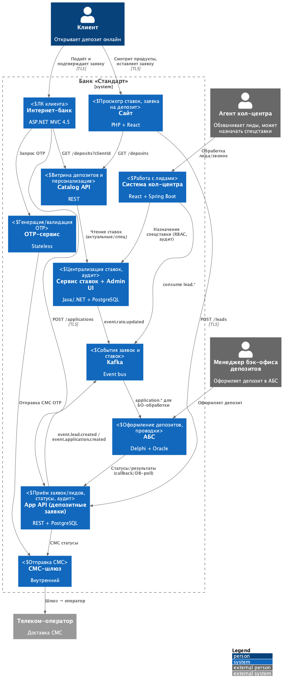
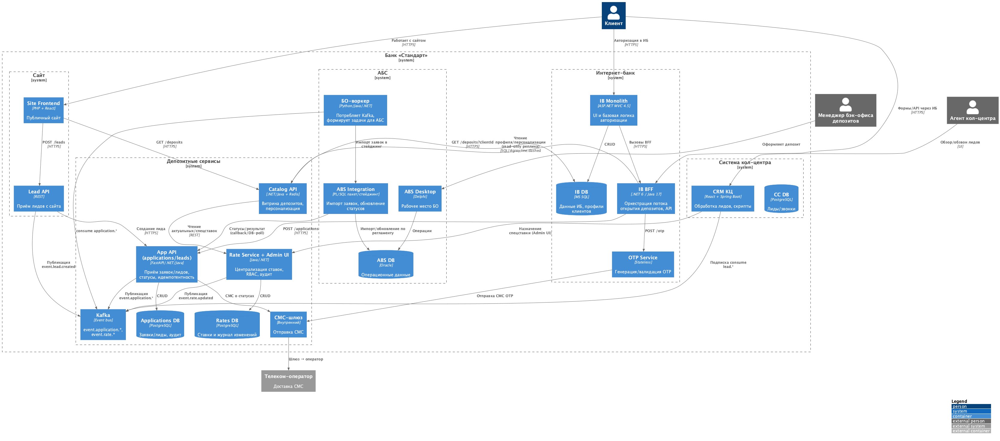

### **Название задачи:** MVP открытия депозитов в интернет-банке и на сайте с централизацией ставок
### **Автор:** Антон Яковлев
### **Дата:** 02.01.2026
### **Функциональные требования**
Опишите здесь верхнеуровневые Use Cases. Их нужно оформить в виде таблицы с пошаговым описанием:

|**№**|**Действующие лица или системы**|**Use Case**|**Описание**|
| :-: | :- | :- | :- |
|UC1|Клиент, Сайт, Catalog API|Просмотр перечня депозитов на сайте|1. Клиент открывает страницу «Депозиты» на сайте   2. Сайт вызывает Catalog API для получения актуальных ставок   3. Catalog API обращается к Сервису ставок за актуальными ставками   4. Клиент видит список доступных депозитов с актуальными ставками|F1|
|UC2|Клиент, Сайт, Lead API, Система кол-центра|Заявка на депозит с сайта|1. Клиент заполняет форму заявки на депозит, указывая ФИО и номер телефона   2. Сайт шифрует трафик (TLS) и отправляет данные в Lead API   3. Lead API создаёт лид и публикует событие в Kafka   4. Система кол-центра получает лид и менеджер связывается с клиентом для уточнения условий|F2, F3|
|UC3|Агент кол-центра, Admin UI ставок, Сервис ставок|Назначение спецусловий|1. Агент кол-центра видит лид в системе кол-центра   2. При необходимости агент фиксирует спецставку через Admin UI ставок   3. Сервис ставок сохраняет спецставку с аудитом изменений   4. Публикуется событие обновления ставки в Kafka|F3, F10|
|UC4|Клиент, Интернет-банк, BFF, Catalog API|Просмотр депозитов в интернет-банке с персональными ставками|1. Клиент авторизован в интернет-банке   2. Клиент переходит на страницу депозитов   3. BFF интернет-банка запрашивает персонализированные ставки у Catalog API с учётом профиля клиента   4. Catalog API получает данные о клиенте из read-only реплики профилей и формирует персонализированные ставки   5. Клиент видит список депозитов с актуальными ставками и персонализированные ставки лично для него|F5|
|UC5|Клиент, Интернет-банк, BFF, OTP-сервис, СМС-шлюз|Подтверждение заявки СМС-кодом|1. Клиент выбрал депозит и заполнил форму заявки (счёт и сумма депозита)   2. BFF инициирует запрос OTP через OTP-сервис   3. OTP-сервис генерирует код и отправляет его через СМС-шлюз   4. Клиент получает СМС с кодом и вводит его в форму   5. BFF валидирует код через OTP-сервис   6. При успешной валидации заявка создаётся|F6, F7|
|UC6|Клиент, Интернет-банк, App API, Kafka, БО депозитов, АБС|Подача заявки в интернет-банке|1. После подтверждения OTP BFF создаёт заявку в App API   2. App API сохраняет заявку в базе данных и публикует событие в Kafka   3. БО-воркер потребляет событие из Kafka и формирует задачу для бэк-офиса депозитов   4. Прямых онлайн-вызовов АБС нет, изоляция АБС соблюдена|F6, R3|
|UC7|Менеджер бэк-офиса депозитов, АБС, App API, СМС-шлюз|Обработка заявки и открытие депозита|1. Менеджер бэк-офиса депозитов видит заявку в АБС через интерфейс рабочего места   2. Менеджер подтверждает условия открытия депозита в АБС   3. АБС обрабатывает заявку и открывает депозит   4. Статус заявки обновляется в App API через интеграционный слой АБС   5. App API отправляет СМС-уведомление клиенту о подтверждении размера ставки и открытии депозита через СМС-шлюз|F8, F9|
|UC8|Все системы, Observability Stack|Аудит, наблюдаемость, мониторинг|1. Все действия по ставкам и заявкам логируются   2. Метрики производительности собираются через Prometheus   3. Трассировка запросов через OpenTelemetry   4. Аудит изменений ставок в Сервисе ставок|R1, S3|
### **Нефункциональные требования**
Опишите здесь нефункциональные требования и архитектурно значимые требования.

|**№**|**Требование**|
| :-: | :- |
|NFR1|**Надёжность (Reliability)**: Все сервисы должны работать 24/7 и быть доступны в 99,9% случаев (R1)|
|NFR2|**Отказоустойчивость**: В случае сбоев в ЦОД интернет-банк должен быть доступен и выдерживать требуемую нагрузку, переключившись на резервный ЦОД (R2)|
|NFR3|**Изоляция АБС**: Избежать прямой работы интернет-банка с API АБС в новом процессе. База данных АБС уже перегружена, онлайн-подача заявок может поставить под угрозу работоспособность банка (R3)|
|NFR4|**Безопасность**: Чувствительная информация, передаваемая с сайта и в интернет-банке, должна быть защищена механизмом шифрования трафика (TLS 1.2+) (R4, R5)|
|NFR5|**Производительность**: Отклик по всем операциям должен быть максимально быстрым и занимать миллисекунды. p95: списки депозитов ≤500 мс, создание заявки ≤800 мс, доставка OTP ≤30 с (P1, P2)|
|NFR6|**Масштабируемость**: Предусмотреть равномерное горизонтальное масштабирование и распределение запросов между серверами, приложениями и ЦОД (P3)|
|NFR7|**Кэширование**: Кэш ставок и справочников для ускорения загрузки, инвалидация по событию обновления ставок (P2)|
|NFR8|**Технологические ограничения**: Интернет-банк реализован на ASP.NET MVC 4.5 на основе .NET Framework 4.5. Текущая версия платформы интернет-банка несовместима с Kafka (+R3, +R4)|
|NFR9|**Централизация ставок**: Ставки по депозитам должны храниться в централизованном хранилище в банковской системе, не в XLS-файлах. Требуется аудит изменений (+R1, F10)|
|NFR10|**Совместимость технологий**: Использовать технологии, которые уже есть в банке (MS SQL, Oracle, Java/.NET, Python). Kafka как брокер сообщений на перспективу (S1, S2, S3, +R5)|
|NFR11|**Микросервисная архитектура**: Возможно стоит подумать о переводе интернет-банка на микросервисную архитектуру, но пока только в рамках задачи открытия депозитов (+R4)|
|NFR12|**Идемпотентность**: Обеспечить идемпотентность и дедупликацию заявок/сообщений для предотвращения дублирования операций (R4)|
|NFR13|**Наблюдаемость**: Логи, трассировки, метрики через Prometheus/Grafana, OpenTelemetry трассировки, API-контракты (S3)|
### **Решение**

Диаграммы в отдельных файлах PlantUML:

* Контекст: `C4_context.puml`
* Контейнеры: `C4_containers.puml`

#### C4-Контекст

#### C4-Контейнеры

#### Ключевая логика решения:

1. **Сервис ставок**: Централизованное хранилище ставок и спецусловий с Admin UI для кол-центра и бэк-офиса. Кэширование на чтение для производительности. Публикация событий «rate.updated» в Kafka для синхронизации ставок между системами. Аудит всех изменений ставок. (F1, F3, F5, F10, +R1, NFR9)

2. **Catalog API**: Единая точка чтения продуктовой витрины для Сайта и Интернет-банка. Персонализация в интернет-банке на основе профиля клиента из read-only кэша профилей (реплика/ETL из АБС), без онлайн-вызовов в АБС. Кэширование ставок для ускорения отклика. (F1, F5, R3, P2, P3)

3. **Интернет-банк BFF**: Внешний оркестратор потока открытия депозитов без изменения ядра интернет-банка. Реализует формы, OTP-флоу, создание заявок. Работает как отдельный микросервис, что позволяет обойти ограничение несовместимости с Kafka в ядре интернет-банка. (+R3, +R4, S4)

4. **OTP-сервис**: Stateless сервис для генерации и валидации одноразовых кодов. Работает через существующий СМС-шлюз. Избегает доработок ядра интернет-банка со стороны подрядчика. (F7, P2, R6, +R2)

5. **App API (Deposit Applications)**: Приём и хранение заявок и лидов, идемпотентность для предотвращения дублирования, аудит всех операций. Публикует события в Kafka для БО-воркфлоу. Отдельный сервис, не зависящий от ядра интернет-банка. (F2, F6, R4, R5)

6. **БО-воркер**: Потребляет события из Kafka, формирует задачу для бэк-офиса. Интегрируется с АБС через согласованный импорт (PL/SQL пакет/стейджинг). Онлайн-нагрузка на АБС исключена, соблюдается изоляция АБС. (F8, R3, +R4, +R6)

7. **Интеграция с АБС**: Через файловый/DB-стейджинг по регламенту, без прямых REST-вызовов. PL/SQL пакет для импорта заявок и обновления статусов. Статусы возвращаются в App API через callback или DB-poll. (R3, +R4, +R6)

8. **Статусы и уведомления**: Изменения статуса в App API → СМС через СМС-шлюз клиенту. (F9)

9. **Наблюдаемость и SLO**: Метрики latency/throughput/ошибок через Prometheus, трассировки по сквозным корреляторам через OpenTelemetry, алерты в Grafana. (R1, S3, NFR13)

10. **CI/CD и отказоустойчивость**: Фронт-сервисы масштабируются горизонтально, rolling/blue-green деплойменты, DR-план для переключения на резервный ЦОД. (R2, P3, S4)

#### Технологии:

* **BFF, Catalog API**: .NET 6 или Java 17, REST, OpenAPI, Redis-кэш для ставок и справочников
* **Сервис ставок, Admin UI**: Java/.NET + PostgreSQL, аудит в append-only таблицах
* **App API**: Python FastAPI или Java/.NET + PostgreSQL, Kafka для событий
* **OTP**: Stateless сервис + существующий СМС-шлюз
* **БО-воркер**: Python/Java/.NET, потребляет Kafka, интегрируется с АБС через стейджинг
* **АБС интеграция**: PL/SQL пакет для импорта/изменений, файловый/DB-стейджинг по регламенту
* **Безопасность**: TLS 1.2+ для внешних соединений, mTLS для внутреннего контура, маскирование PII в логах, RBAC для Admin UI ставок
* **Наблюдаемость**: Prometheus + Grafana для метрик, OpenTelemetry для трассировки, централизованное логирование
### **Альтернативы**

1. **Прямые REST-вызовы Интернет-банк → АБС**
   Минусы: нарушает изоляцию АБС, риск перегрузки базы данных АБС онлайн-запросами, высокий технический долг, нарушение требования R3.

2. **Реализация всего внутри ядра Интернет-банка**
   Минусы: завязка на подрядчика, длинные циклы релизов, невозможность использования Kafka из-за ограничения +R3, нарушение принципа разделения ответственности.

3. **Ставки через XLS с импортом по расписанию**
   Минусы: несогласованность данных между системами, отсутствие аудита изменений, риск ошибок при ручном вводе, нарушение требования +R1 и F10.

4. **Очередь RabbitMQ вместо Kafka**
   Минусы: не соответствует предпочтению +R5 использовать Kafka на перспективу; допустимо как временный мост для интернет-банка, если требуется совместимость.

5. **Отсутствие BFF, работа напрямую через ядро Интернет-банка**
   Минусы: невозможность обойти ограничение несовместимости с Kafka, необходимость доработок подрядчика, нарушение изоляции АБС.

**Недостатки, ограничения, риски**

1. **Персонализация в интернет-банке зависит от качества репликации профиля клиента из АБС**: Возможна задержка обновления сегмента клиента, что может привести к отображению неактуальных персонализированных ставок. Необходимо обеспечить актуальность данных в read-only реплике.

2. **Ручной этап в бэк-офисе остаётся в MVP**: SLA обработки заявки «1 день» зависит от дисциплины обработки менеджерами бэк-офиса. Автоматизация полного цикла требует дополнительной проработки интеграции с АБС.

3. **Необходимы согласованные интерфейсы импорта в АБС и регламент изменений**: Требуется тесное взаимодействие с командой поддержки АБС для согласования форматов данных и регламентов обмена. Изменения в АБС могут потребовать адаптации интеграционного слоя.

4. **Требуется единая дизайн-система и BFF-страницы под домен интернет-банка без изменений ядра**: Необходимо обеспечить консистентность UI/UX между существующим интернет-банком и новым функционалом открытия депозитов. BFF должен органично вписываться в архитектуру интернет-банка.

5. **Комплаенс ПДн**: Контроль маскирования персональных данных в логах и разграничение доступа к Admin UI ставок. Необходимо обеспечить соответствие требованиям защиты персональных данных при работе с заявками и профилями клиентов.

6. **Технический долг интернет-банка**: Монолитная архитектура интернет-банка создаёт риски масштабирования функционала в будущем. Переход на микросервисную архитектуру только в рамках задачи открытия депозитов может создать сложности при дальнейшем развитии системы.

7. **Зависимость от Kafka для новых сервисов**: Хотя ядро интернет-банка несовместимо с Kafka, новые сервисы (BFF, App API) используют Kafka. Это создаёт архитектурное разделение, которое необходимо поддерживать и документировать.

8. **Риск перегрузки при масштабировании**: При росте количества заявок необходимо обеспечить горизонтальное масштабирование всех компонентов, включая Kafka, базы данных и сервисы. Требуется мониторинг производительности и планирование capacity.

