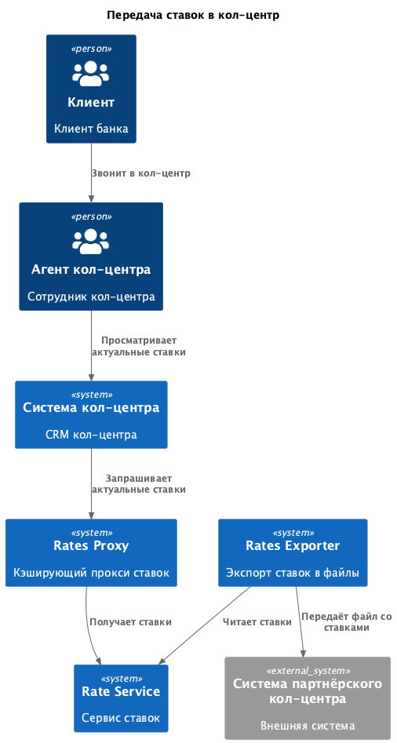
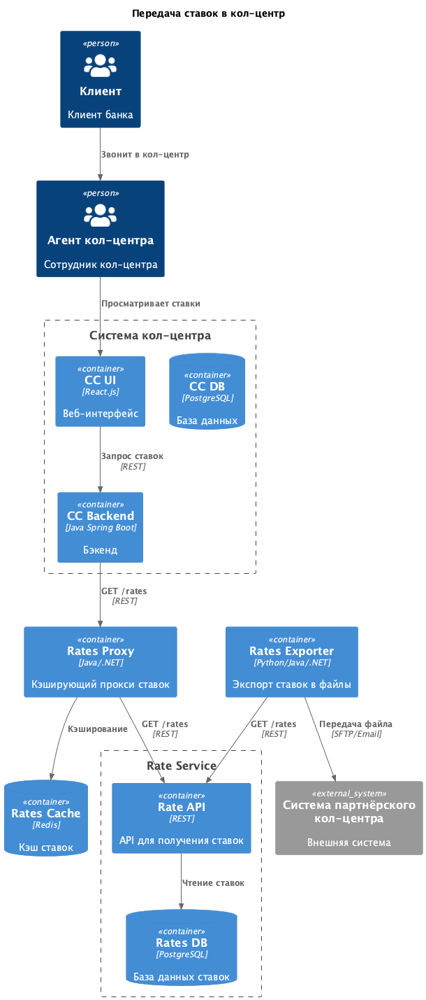

### **Название задачи:** Передача и использование депозитных ставок в кол-центрах (включая партнёрский)
### **Автор:** Антон Яковлев
### **Дата:** 02.01.2026
### **Функциональные требования**
Опишите здесь верхнеуровневые Use Cases. Их нужно оформить в виде таблицы с пошаговым описанием:

|**№**|**Действующие лица или системы**|**Use Case**|**Описание**|**Комментарий**|
| :-: | :- | :- | :- | :- |
|UC1|Клиент, Агент кол-центра, CRM КЦ, Rates Proxy|Консультация по ставкам|1. Клиент звонит в кол-центр с вопросом о ставках по депозитам   2. Агент кол-центра открывает карточку клиента в CRM КЦ   3. CRM КЦ запрашивает актуальные ставки у Rates Proxy   4. Rates Proxy возвращает кэшированные ставки или обращается к Rate Service за актуальными данными   5. Агент кол-центра видит актуальные ставки в интерфейсе и консультирует клиента|Требование: сотрудники кол-центра должны консультировать по ставкам|
|UC2|Rates Exporter, Rate Service, Система партнёрского кол-центра|Передача актуальных ставок партнёрскому кол-центру|1. Rates Exporter подписан на события rate.updated из Kafka или работает по расписанию   2. Rates Exporter запрашивает актуальные ставки у Rate Service   3. Rates Exporter формирует файл (CSV/JSON) со ставками   4. Файл передаётся партнёрскому кол-центру через SFTP/email|Партнёрский кол-центр получает файлы, нет API-вызовов|
### **Нефункциональные требования**

|**№**|**Требование**|
| :-: | :- |
|NFR1|**Единый источник истины**: Rate Service является единственным источником ставок. Все системы получают ставки только из Rate Service|
|NFR2|**Актуализация для внутреннего кол-центра**: Ставки в CRM кол-центра должны обновляться в течение 5 минут после изменения в Rate Service|
|NFR3|**Актуализация для партнёрского кол-центра**: Полный снапшот ставок ежедневно в 07:00, инкрементальные дельты по событию обновления, но не чаще 1 раза в час|
|NFR4|**Безопасность передачи**: TLS для внутренних соединений. Для партнёрского кол-центра - SFTP/FTPS или зашифрованный email|
|NFR5|**Производительность**: Отклик по операциям просмотра ставок в кол-центре должен быть максимально быстрым. Кэширование через Rates Proxy|
|NFR6|**Технологические ограничения**: Система кол-центра - React.js фронтенд, Java Spring Boot бэкенд, PostgreSQL БД. Развёрнута в инфраструктуре банка|
|NFR7|**Ограничения партнёрского кол-центра**: Партнёрский кол-центр - внешняя система. Нет возможности API-вызовов, только файловая передача через SFTP/email|
### **Решение**

Диаграммы в отдельных файлах PlantUML:

* Контекст: `C4_context.puml`
* Контейнеры: `C4_containers.puml`

#### C4-Контекст

#### C4-Контейнеры

#### Ключевая логика решения:

1. **Rate Service как единый источник истины**: Используем существующий Rate Service из Task3. Rate Service публикует события rate.updated в Kafka для синхронизации с другими системами.

2. **Rates Proxy для внутреннего кол-центра**: Новый сервис Rates Proxy работает как кэширующий прокси между CRM кол-центра и Rate Service. Кэширует ставки в Redis для быстрого доступа. Подписан на события rate.updated из Kafka для инвалидации кэша и обеспечения актуализации данных в течение 5 минут.

3. **Rates Exporter для партнёрского кол-центра**: Новый сервис Rates Exporter подписан на события rate.updated из Kafka. Формирует файлы со ставками в формате CSV/JSON. Реализует два режима: полный снапшот ежедневно в 07:00 и инкрементальные дельты по событию (но не чаще 1 раза в час). Файлы передаются партнёрскому кол-центру через SFTP/email.

#### Технологии:

* **Rates Proxy**: Java/.NET, REST API, Redis для кэширования, подписка на Kafka для инвалидации кэша
* **Rates Exporter**: Python/Java/.NET, batch worker, подписка на Kafka, генерация CSV/JSON
* **CRM кол-центра**: Интеграция через REST API к Rates Proxy
### **Альтернативы**

1. **Прямые REST-вызовы CRM кол-центра к Rate Service без прокси**
   Минусы: отсутствие кэширования приведёт к высокой нагрузке на Rate Service при большом количестве запросов от агентов кол-центра.

2. **Реплика базы данных Rate Service в систему кол-центра**
   Минусы: сложность поддержки схемы и синхронизации данных. Риск рассинхронизации. Нарушение принципа единого источника истины.

3. **API-вызовы партнёрского кол-центра к Rate Service**
   Минусы: партнёрский кол-центр не имеет возможности делать API-вызовы. Требовалось бы открытие внешнего API, что усложняет безопасность периметра.

**Недостатки, ограничения, риски**

1. **Задержка актуализации данных в партнёрском кол-центре**: Партнёрский кол-центр получает данные пакетно через файлы. Между выгрузками возможна задержка до часа.

2. **Организационные процессы для партнёрского кол-центра**: Требуется согласование форматов файлов и регламентов обмена с партнёрским кол-центром.

3. **Зависимость от канала передачи файлов**: Отказ канала передачи (SFTP/email) потребует ручного контроля и повторных попыток доставки.

### Список крупных задач по системам

**Rate Service**

* Реализовать публикацию событий `rate.updated` в Kafka при изменении ставок

**Rates Proxy (новый сервис)**

* Разработать REST API для получения ставок с поддержкой кэширования
* Реализовать интеграцию с Redis для кэширования ставок
* Настроить подписку на события `rate.updated` из Kafka для инвалидации кэша

**CRM кол-центра**

* Добавить экран просмотра ставок в UI кол-центра
* Реализовать интеграцию с Rates Proxy через REST API

**Rates Exporter (новый сервис)**

* Реализовать подписку на события `rate.updated` из Kafka
* Разработать логику формирования файлов со ставками (CSV/JSON формат)
* Реализовать два режима работы: полный снапшот ежедневно в 07:00 и инкрементальные дельты по событию (не чаще 1 раза в час)
* Обеспечить передачу файлов партнёрскому кол-центру через SFTP/email

