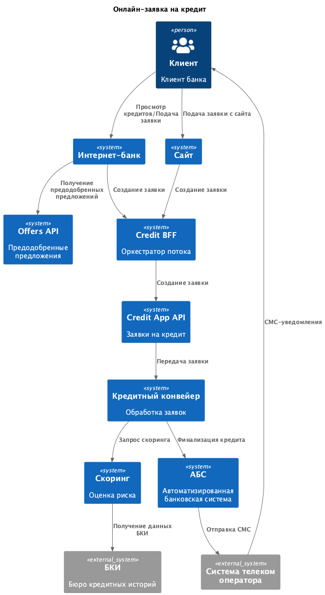
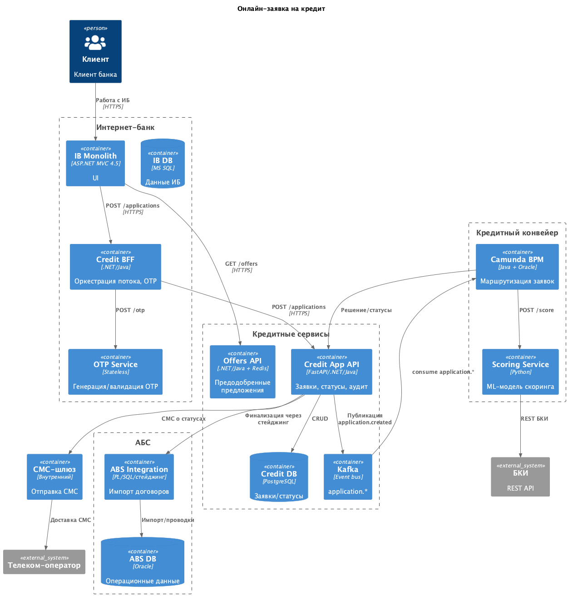

### **Название задачи:** Онлайн-заявка на кредит
### **Автор:** Антон Яковлев
### **Дата:** 02.01.2026
### **Функциональные требования**

|**№**|**Действующие лица или системы**|**Use Case**|**Описание**|
| :-: | :- | :- | :- |
|UC1|Клиент, Интернет-банк, Offers API|Просмотр кредитов и предодобренных предложений|1. Клиент авторизован в интернет-банке   2. Клиент переходит на страницу кредитов   3. Интернет-банк запрашивает предодобренные предложения у Offers API   4. Клиент видит список доступных кредитов и предодобренные предложения|F16|
|UC2|Клиент, Интернет-банк, Credit BFF, OTP-сервис|Подача заявки на кредит|1. Клиент выбрал кредит и заполнил форму заявки   2. Credit BFF инициирует запрос OTP через OTP-сервис   3. Клиент получает СМС с кодом и вводит его   4. После подтверждения заявка создаётся в Credit App API|F17|
|UC3|Клиент, Сайт, Credit BFF|Подача заявки с сайта|1. Клиент заполняет форму заявки на кредит (персональные данные)   2. Сайт отправляет данные в Credit BFF   3. При указании паспорта выполняется скоринг через БКИ   4. Клиент получает предварительное решение|F12, F13|
|UC4|Кредитный конвейер, Скоринг, БКИ|Обработка заявки и скоринг|1. Кредитный конвейер получает заявку из Kafka   2. Кредитный конвейер запрашивает скоринг у Скоринг-сервиса   3. Скоринг-сервис обращается к БКИ за данными   4. Кредитный конвейер принимает решение по заявке|F18|
|UC5|Кредитный конвейер, АБС|Финализация кредита|1. После принятия решения Кредитный конвейер передаёт данные в АБС через стейджинг   2. АБС оформляет договор и проводит операции   3. Статус возвращается в Credit App API|F15|
|UC6|Клиент, Credit App API, СМС-шлюз|Уведомление о статусе заявки|1. При изменении статуса заявки Credit App API отправляет СМС клиенту через СМС-шлюз   2. Клиент получает уведомление о статусе заявки|F19|

### **Нефункциональные требования**

|**№**|**Требование**|
| :-: | :- |
|NFR1|**Надёжность**: Все сервисы должны работать 24/7 и быть доступны в 99,9% случаев (R1)|
|NFR2|**Изоляция АБС**: Избежать прямой работы интернет-банка с API АБС. Интеграция через стейджинг/пакеты (R3)|
|NFR3|**Безопасность**: Чувствительная информация должна быть защищена механизмом шифрования трафика (TLS) (R4, R5)|
|NFR4|**Производительность**: Отклик по операциям должен быть максимально быстрым. Создание заявки p95 ≤ 800 мс, показ офферов p95 ≤ 500 мс (P1, P2)|
|NFR5|**Скоринг**: Дополнительные процессы по предрасчётам скорингов производить в нерабочие часы банка (P4)|
|NFR6|**Обмен с АБС**: Обмен между АБС и Кредитным конвейером происходит раз в сутки, ускорить его чаще невозможно (+R2)|
|NFR7|**Масштабируемость**: Кредитный конвейер должен поддерживать горизонтальное масштабирование (P5)|

### **Решение**

Диаграммы в отдельных файлах PlantUML:

* Контекст: `C4_context.puml`
* Контейнеры: `C4_containers.puml`

#### C4-Контекст

#### C4-Контейнеры

#### Ключевая логика решения:

1. **Credit BFF**: Прослойка реализованная в виде паттерна BFF. Реализует формы, OTP-флоу, создание заявок. Работает как отдельный микросервис.

2. **Offers API**: Предоставляет предодобренные предложения по кредитам для клиентов банка. Использует read-only реплику профилей клиентов из АБС.

3. **Credit App API**: Приём и хранение заявок на кредит, идемпотентность, аудит. Публикует события в Kafka для Кредитного конвейера.

4. **Кредитный конвейер**: Обрабатывает заявки, выполняет скоринг через Скоринг-сервис и БКИ, принимает решения. Интегрируется с АБС через стейджинг без прямых онлайн-вызовов.

5. **Интеграция с АБС**: Через файловый/DB-стейджинг по регламенту, без прямых REST-вызовов. Статусы возвращаются в Credit App API.

#### Технологии:

* **Credit BFF**: .NET 6 или Java 17, REST API
* **Offers API**: .NET/Java + Redis для кэширования
* **Credit App API**: Python FastAPI или Java/.NET + PostgreSQL, Kafka для событий
* **Кредитный конвейер**: Camunda BPM + Oracle
* **Скоринг**: Python ML-сервис, REST API
* **OTP**: Stateless сервис + существующий СМС-шлюз

### **Альтернативы**

1. **Прямые онлайн-вызовы Интернет-банк -> АБС**
   Минусы: нарушает изоляцию АБС, риск перегрузки базы данных АБС, нарушение требования R3.

2. **Реализация всего внутри ядра Интернет-банка**
   Минусы: завязка на подрядчика, длинные циклы релизов, невозможность использования Kafka из-за ограничения +R4.

3. **Оставить batch обмен АБС <-> Кредитный конвейер раз в сутки**
   Минусы: не выполняет требование обработки заявки в течение рабочего дня, хуже UX для клиентов.

**Недостатки, ограничения, риски**

1. **Задержка обмена с АБС**: Обмен между АБС и Кредитным конвейером происходит раз в сутки. Финализация кредита может занять до суток.

2. **Зависимость от БКИ**: Для новых клиентов с сайта используется только БКИ для скоринга. Ограничения БКИ по частоте запросов и доступности могут влиять на скорость обработки заявок.

3. **KYC офлайн для новых клиентов**: Новые клиенты с сайта должны прийти в отделение для идентификации перед получением кредита. Полностью онлайн-процесс невозможен.
